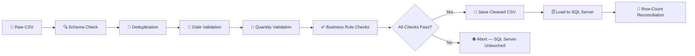

# 🛍️ NexaRetail Sales Analytics Pipeline

> An automated ETL pipeline that cleans, validates, and loads NexaRetail's sales data into SQL Server — powering a 3-year (2023–2025) business intelligence review across revenue, profitability, and customer retention.


---

## 📖 Overview

This repository contains the end-to-end data pipeline behind NexaRetail's sales analytics dashboards. Raw transactional exports (order-level retail data spanning 2023–2025) are ingested, cleaned, validated against a set of business rules, and loaded into a SQL Server warehouse table — with every run producing a full, timestamped audit trail of what was cleaned, rejected, and loaded.

The pipeline is designed around one core principle: **the warehouse should never be left in a worse or inconsistent state than before a run.** If the incoming data fails validation for any reason, the pipeline aborts *before* touching SQL Server, so downstream dashboards and reports always reflect the last known-good dataset.

This pipeline directly feeds the **NexaRetail Three-Year Review (2023–2025)** report, which covers:

- 📈 Sales, profit & margin trends across the company and by product category
- 🧾 Product & subcategory profitability, including where and why orders lose money
- 👥 Customer retention, order behavior, and segment mix shifts

### Why this pipeline exists

Retail sales exports are messy in predictable ways — duplicate rows from re-exports, malformed or ambiguous date formats, occasional negative quantities from return/adjustment entries, and missing values from upstream system glitches. Rather than cleaning this by hand before every reporting cycle, this pipeline automates the entire process so that:

- Analysts always work from a single, consistently-cleaned source of truth (`sales_data_cleaned.csv` + the `dbo.Sales` table).
- Nothing is silently discarded — every rejected record is preserved in its own file for follow-up.
- The refresh can be triggered with a single double-click (`refresh_nexaretail.bat`) or scheduled to run unattended.

## 🗂️ Repository Structure

```
NexaRetail-Sales-Analytics/
│
├── sales_analytics_pipeline_automated.py   # Core ETL script (extract → clean → validate → load)
├── refresh_nexaretail.bat                  # One-click Windows launcher for the pipeline
│
├── sales_data_raw.csv                      # Raw input data (source export, ~10K rows)
├── sales_data_cleaned.csv                  # Cleaned, validated output (auto-generated each run)
│
├── NexaRetail_Report.pdf                   # 3-year business intelligence report (2023–2025)
│
├── logs/                                   # Timestamped run logs (auto-generated)
│   └── etl_YYYY-MM-DD_HH-MM-SS.log
│
├── rejected_order_dates.csv                # Records rejected for invalid/unparseable dates (auto-generated)
└── rejected_quantity_records.csv           # Records rejected for negative quantity (auto-generated)
```

> 💡 **Note:** `sales_data_cleaned.csv`, the `logs/` directory, and both `rejected_*.csv` files are build artifacts — they're regenerated every time the pipeline runs. You may want to add them to `.gitignore` if you don't need to version-control historical outputs, or commit them if you want a change history of each refresh.

### Suggested `.gitignore`

```gitignore
logs/
sales_data_cleaned.csv
rejected_order_dates.csv
rejected_quantity_records.csv
__pycache__/
*.pyc
.venv/
```

## ⚙️ How the Pipeline Works



### Step-by-step breakdown

**1. File & schema check**
Before any processing begins, the script confirms `sales_data_raw.csv` exists and that all 15 required columns are present (`Order_ID`, `Order_Date`, `Ship_Date`, `Customer_ID`, `Segment`, `Region`, `State`, `City`, `Category`, `Sub_Category`, `Quantity`, `Unit_Price`, `Discount`, `Sales`, `Profit`). If the file is missing or any column is absent, the pipeline raises an error immediately and never touches SQL Server.

**2. Initial data quality scan**
Logs a full null-value count per column and the number of exact duplicate rows *before* any cleaning happens — giving you a baseline snapshot of raw data health in every log file.

**3. Deduplication**
Exact duplicate rows (every column identical) are dropped via `drop_duplicates()`. The count of removed rows is logged.

**4. Missing-sales removal**
Rows with a null `Sales` value are dropped, since `Sales` is treated as the non-negotiable core metric for every downstream calculation.

**5. Date parsing & normalization**
`Order_Date` and `Ship_Date` are parsed with pandas' flexible `format="mixed"` parser (`dayfirst=True`) to handle mixed date formats gracefully, converting invalid/unparseable entries to `NaT` rather than throwing an error mid-run.

**6. Invalid order-date quarantine**
Any row where `Order_Date` failed to parse is written verbatim to `rejected_order_dates.csv` and removed from the working dataset — so no record is ever silently lost, only set aside for review. `Ship_Date` nulls are tracked but *not* dropped at this stage (they're caught in final validation instead).

**7. Invalid quantity quarantine**
Rows with a negative `Quantity` are written to `rejected_quantity_records.csv` and removed from the working set.

**8. Business rule validation**
A battery of pass/fail checks is run and logged, covering:
| Rule | Condition | Behavior on failure |
|---|---|---|
| Quantity | Must be ≥ 0 | Already filtered in step 7; rechecked here as a safety net |
| Discount | Must be between 0 and 1 (0%–100%) | Flagged as `FAIL`, blocks the load |
| Sales | Must be ≥ 0 | Flagged as `FAIL`, blocks the load |
| Profit | May be negative | **Always passes** — negative profit represents a legitimate loss-making order, not bad data |

**9. Final validation gate**
Before anything is written to SQL Server, the pipeline re-checks the *entire* cleaned dataset for: remaining nulls, remaining duplicates, negative quantities, invalid discounts, negative sales, and invalid ship dates. **All six must pass.** If even one fails, the script raises an exception, logs `Final validation: FAIL`, and explicitly confirms *"SQL Server was NOT changed because the new data failed validation."*

**10. Cleaned file export**
Only after passing final validation is `sales_data_cleaned.csv` written to disk, overwriting the previous version.

**11. SQL Server connection**
Connects using SQLAlchemy + `pyodbc` via the ODBC Driver 18 for SQL Server, with a trusted (Windows) connection and `TrustServerCertificate=yes` for local/dev use.

**12. Transactional load**
Inside a single `engine.begin()` transaction block:
   - `DELETE FROM dbo.Sales` clears the existing table.
   - The cleaned DataFrame is appended back in via `to_sql(..., if_exists="append")`.

   Because both operations share one transaction, **if the insert fails for any reason (schema mismatch, connectivity drop, etc.), the delete is automatically rolled back** — the table is left exactly as it was before the run started.

**13. Post-load reconciliation**
After the transaction commits, the script queries `SELECT COUNT(*) FROM dbo.Sales` and compares it against the expected row count from the cleaned DataFrame. A mismatch raises an error and is logged as `Row count check: FAIL`, flagging a data integrity issue for manual investigation even though the load technically completed.

**14. Run summary & logging**
Every run — success or failure — writes a complete, human-readable log to `logs/etl_<timestamp>.log`, including row counts at every stage, validation results, and the final outcome. On failure, the exception message is captured in the log before being re-raised.

## 🚀 Getting Started

### Prerequisites

| Requirement | Notes |
|---|---|
| Python 3.10+ | Earlier 3.x versions likely work but are untested |
| [ODBC Driver 18 for SQL Server](https://learn.microsoft.com/en-us/sql/connect/odbc/download-odbc-driver-for-sql-server) | Must be installed at the OS level, not just via pip |
| SQL Server instance | Local or remote; the default config assumes a local instance with Windows/trusted authentication |
| A `SalesAnalytics` database | Must already exist, with a `dbo.Sales` table matching the schema below |
| Windows (recommended) | For the `.bat` launcher; the Python script itself is cross-platform |

### Installation

Clone the repository and install the Python dependencies:

```bash
git clone https://github.com/<your-org>/nexaretail-sales-analytics.git
cd nexaretail-sales-analytics
pip install pandas sqlalchemy pyodbc
```

It's recommended to use a virtual environment:

```bash
python -m venv .venv
.venv\Scripts\activate      # Windows
source .venv/bin/activate   # macOS/Linux
pip install pandas sqlalchemy pyodbc
```

### Preparing SQL Server

Before the first run, create the target database and table so the pipeline has somewhere to load data:

```sql
CREATE DATABASE SalesAnalytics;
GO

USE SalesAnalytics;
GO

CREATE TABLE dbo.Sales (
    Order_ID        VARCHAR(20),
    Order_Date      DATE,
    Ship_Date       DATE,
    Ship_Mode       VARCHAR(50),
    Customer_ID     VARCHAR(20),
    Customer_Name   VARCHAR(100),
    Segment         VARCHAR(50),
    Region          VARCHAR(50),
    State           VARCHAR(100),
    City            VARCHAR(100),
    Category        VARCHAR(50),
    Sub_Category    VARCHAR(50),
    Quantity        INT,
    Unit_Price      DECIMAL(12, 2),
    Discount        DECIMAL(5, 2),
    Sales           DECIMAL(14, 2),
    Profit          DECIMAL(14, 2)
);
```

> The pipeline uses `to_sql(if_exists="append")` on a pre-cleared table, so the table structure above must already exist — the script does not auto-create it.

### Running the Pipeline

**Windows (one-click):**
```bash
refresh_nexaretail.bat
```
This opens a console window, `cd`'s into the script's own directory (so it works regardless of where it's launched from), runs the pipeline, and prints clear start/finish banners.

**Manually, on any OS:**
```bash
python sales_analytics_pipeline_automated.py
```

The script expects `sales_data_raw.csv` to be present in the same directory as the script. On a successful run it will generate/refresh:
- `sales_data_cleaned.csv`
- `rejected_order_dates.csv` and `rejected_quantity_records.csv` (only populated if bad records were found)
- a new timestamped file inside `logs/`

### Scheduling automatic refreshes

To run this unattended on a schedule:

**Windows Task Scheduler:**
1. Open Task Scheduler → *Create Task*.
2. Trigger: e.g. daily at 6:00 AM.
3. Action: *Start a program* → point it at `refresh_nexaretail.bat`.
4. Under *Settings*, enable "Run whether user is logged on or not" if it needs to run unattended.

**cron (macOS/Linux, if adapted for a non-Windows SQL setup):**
```bash
0 6 * * * /usr/bin/python3 /path/to/sales_analytics_pipeline_automated.py >> /path/to/logs/cron.log 2>&1
```

### Configuration

Connection details are currently defined inline near the top of the SQL-loading section of `sales_analytics_pipeline_automated.py`:

```python
server   = "localhost"
database = "SalesAnalytics"

connection_string = (
    "DRIVER={ODBC Driver 18 for SQL Server};"
    "SERVER=localhost;"
    "DATABASE=SalesAnalytics;"
    "Trusted_Connection=yes;"
    "TrustServerCertificate=yes;"
)
```

Update `SERVER=` and `DATABASE=` to match your environment. If you're connecting with SQL authentication instead of a trusted/Windows connection, replace `Trusted_Connection=yes;` with:

```python
"UID=your_username;"
"PWD=your_password;"
```

> 🔒 **Security tip:** Avoid hardcoding credentials directly in the script for production use. Consider loading them from environment variables (`os.environ`) or a `.env` file excluded via `.gitignore`.

## 🩺 Troubleshooting

| Symptom | Likely Cause | Fix |
|---|---|---|
| `FileNotFoundError: Raw file not found` | `sales_data_raw.csv` isn't in the same folder as the script | Place the raw CSV alongside the `.py` file, or update `RAW_FILE` path |
| `ValueError: Required columns missing` | Source export schema changed or a column was renamed | Check the exact column names in the raw CSV against `required_columns` in the script |
| Final validation always fails | Upstream export has systemic discount/date issues | Check `rejected_order_dates.csv`, `rejected_quantity_records.csv`, and the log's `BUSINESS VALIDATION` section for specifics |
| `sqlalchemy.exc.OperationalError` on connect | ODBC driver missing, or SQL Server not reachable | Confirm ODBC Driver 18 is installed and the instance name/port is correct |
| `Row count check: FAIL` after a load | Load partially succeeded or a concurrent write occurred | Re-run the pipeline; investigate `dbo.Sales` directly if it persists |
| `.bat` file opens and closes instantly | Python isn't on PATH, or an unhandled exception occurred | Run `python sales_analytics_pipeline_automated.py` directly from a terminal to see the full traceback |

## 📝 Sample Log Output

```
============================================================
NexaRetail Sales Analytics Pipeline Started
============================================================
Raw data loaded successfully
Rows: 10042
Columns: 17

DATA QUALITY CHECK
------------------
Missing values:
Order_ID        0
Order_Date      0
...
Duplicate rows: 12

DATA CLEANING
-------------
Duplicate rows removed: 12
Rows after removing duplicates: 10030
Missing Sales rows removed: 3
Rows after handling missing Sales: 10027

DATE PROCESSING
---------------
Date columns converted successfully

DATE VALIDATION
----------------
Invalid Order Dates: 5
Invalid Ship Dates: 0
Rejected Order Date records saved: 5
Rows after removing invalid Order Dates: 10022

QUANTITY VALIDATION
-------------------
Negative Quantity records: 2
Rows after removing invalid quantities: 10020

BUSINESS VALIDATION
-------------------
Negative Quantity remaining: 0
Quantity check: PASS
Invalid Discount remaining: 0
Discount check: PASS
Negative Sales records: 0
Sales check: PASS
Loss-making records: 200
Profit check: PASS (negative Profit represents a loss)

FINAL DATA VALIDATION
---------------------
Final rows: 10020
Missing values: 0
Duplicate rows: 0
Invalid Ship Dates: 0
Final validation: PASS

Cleaned data saved successfully
Cleaned file: sales_data_cleaned.csv
Clean rows: 10020

SQL SERVER CONNECTION
---------------------
SQL Server connection created successfully

LOADING DATA INTO SQL SERVER
----------------------------
Previous SQL data cleared
New cleaned data inserted

SQL SERVER VALIDATION
---------------------
Rows in SQL Server: 10020
Expected rows: 10020
Row count check: PASS

============================================================
NexaRetail ETL COMPLETED SUCCESSFULLY
============================================================
Final rows loaded: 10020
Log file: logs/etl_2026-01-14_06-00-02.log
```

## 🧾 Expected Input Schema

`sales_data_raw.csv` is expected to contain (at minimum) the following 15 required columns — additional columns such as `Ship_Mode` and `Customer_Name` are present in the source data and pass through untouched, but aren't required by the validation logic:

| Column | Type | Description | Validated? |
|---|---|---|---|
| `Order_ID` | string | Unique order identifier (e.g. `ORD-100001`) | — |
| `Order_Date` | date | Date the order was placed | ✅ Must parse to a valid date |
| `Ship_Date` | date | Date the order shipped | ✅ Checked for nulls in final validation |
| `Customer_ID` | string | Unique customer identifier (e.g. `CUST-00066`) | — |
| `Segment` | string | `Consumer`, `Corporate`, or `Home Office` | — |
| `Region` | string | Sales region (e.g. `East`, `Central`) | — |
| `State`, `City` | string | Geographic location of the order | — |
| `Category` | string | `Technology`, `Furniture`, or `Office Supplies` | — |
| `Sub_Category` | string | e.g. `Chairs`, `Pens`, `Paper`, `Tables`, `Sofas` | — |
| `Quantity` | integer | Units ordered | ✅ Must be ≥ 0 |
| `Unit_Price` | decimal | Price per unit | — |
| `Discount` | decimal (0–1) | Discount applied, as a fraction (e.g. `0.2` = 20%) | ✅ Must be between 0 and 1 |
| `Sales` | decimal | Total sales value for the line item | ✅ Must be present and ≥ 0 |
| `Profit` | decimal | Profit for the line item | ✅ Negative values allowed (represents a loss) |

Two additional columns present in the sample data but not enforced by schema validation:

| Column | Type | Description |
|---|---|---|
| `Ship_Mode` | string | `Standard Class`, `Second Class`, `First Class`, or `Same Day` |
| `Customer_Name` | string | Display name of the customer |

## 📊 Key Findings (2023–2025)

The cleaned, validated data this pipeline produces feeds directly into `NexaRetail_Report.pdf` — a three-dashboard business review. Below is a detailed summary of what it found.

### KPIs at a glance

| Metric | 2023 | 2024 | 2025 |
|---|---|---|---|
| Total Sales | Rs. 240.13M | Rs. 235.07M | Rs. 238.04M |
| Total Profit | Rs. 35.76M | Rs. 33.58M | Rs. 35.48M |
| Profit Margin | 14.89% | 14.28% | 14.90% |
| Loss-Making Orders | 191 | 209 | 200 |
| Total Customers | 1,614 | 1,627 | 1,603 |
| Repeat Customers % | 60.78% | 59.00% | 58.70% |

### Dashboard 1 — Overview: Sales, Profit & Margin

- **2023 → 2024** was a step down: sales fell 2.11% and profit fell a sharper 6.09%, even as order count *rose* 1.62% — a sign of shrinking basket size and margin pressure rather than weaker demand.
- **2024 → 2025** was a recovery driven by a different mechanism: sales rebounded 1.26% and profit jumped 5.66% to a 3-year-high margin of 14.90%, but with 3.34% *fewer* orders. Growth came from richer orders, not more of them.
- **Technology** swung from Rs. 148.97M (2023) → Rs. 140.79M (2024) → Rs. 149.52M (2025), tracking the company-wide V-shape almost exactly and explaining most of 2024's decline.
- **Furniture** moved in the opposite direction to Technology, cushioning the 2024 dip before pulling back in 2025 — while **Office Supplies** stayed flat throughout.
- **Segment mix permanently shifted**: Consumer led in 2023 (Rs. 85M), but **Home Office overtook it in 2024** and extended its lead in 2025 (Rs. 84M vs. Rs. 76M) — confirmed independently in the Customer dashboard.

### Dashboard 2 — Product & Profitability Analysis

- Loss-making orders followed their own mini-cycle: 191 → 209 → 200, still ~5% above the 2023 baseline even after the 2025 recovery.
- **Paper is the standout problem**: its loss-making order count climbed every single year (15 → 18 → 24, a 60% increase), becoming the largest single source of loss-making orders by 2024–2025.
- **Sofas** stayed chronically high (15 → 17 → 16); **Tables**, by contrast, improved sharply (14 → 11 → 7) — proof the pattern is fixable with the right intervention.
- **Discounting is structurally dangerous**: the 0% discount band generates the overwhelming majority of profit (~Rs. 17M) in every year, with profit collapsing sharply the moment any discount is applied — consistently, across all three years.
- Low-ticket, thin-margin subcategories (Paper, Pens, Sofas, Tables) are disproportionately pushed into losses by discounting, since shipping/handling cost eats a much larger share of a smaller order value. Technology's healthier 15–17% margin gives it far more room to absorb discounts before turning unprofitable.

### Dashboard 3 — Customer & Order Analysis

- Total customer count barely moved (1,614 → 1,627 → 1,603) — but **Average Order Value swung significantly**, dropping to a 3-year low of Rs. 72.00K in 2024 before jumping to a 3-year high of Rs. 75.42K in 2025, even as the customer count fell.
- **Repeat customer rate is the only metric in the entire review that moved in one direction for all three years**: 60.78% → 59.00% → 58.70%. Every other metric moved in a V-shape; retention just kept sliding.
- The **top 5 customers by sales are entirely different people every year** — no customer ID repeats across 2023, 2024, and 2025 — while the top customer's spend rose from Rs. 0.94M (2023) to a peak of Rs. 1.24M (2024). NexaRetail is replacing its best customers annually rather than retaining them.
- **Shipping preference shifted structurally**: Standard Class orders declined every year (1,240 → 1,180 → 1,121) while Second Class rose every year (384 → 407 → 449) — consistent with the more price-sensitive, less time-sensitive Home Office buyer becoming dominant.

### Prioritized action list (from the report)

1. **Fix retention before chasing more growth** — it's the only metric that's worsened three years running, capping the value of every other improvement.
2. **Resolve Paper's losses and cap discounting** on thin-margin subcategories (Paper, Sofas, Tables, Pens) — a controllable, near-term fix.
3. **Protect and grow Technology while building a second engine** — Furniture is the strongest diversification candidate based on its 2024 performance.
4. **Design specifically around the Home Office buyer** — now the leading segment, with a distinct shipping and purchasing pattern.
5. **Manage customer concentration risk** — a shrinking pool of high-value customers now carries disproportionate weight in total revenue.

📄 See the full report with all charts: [`NexaRetail_Report.pdf`](./NexaRetail_Report.pdf)

## 🛡️ Data Quality & Safety Guarantees

- Invalid or rejected records are **never silently dropped** — they're written to dedicated CSVs for review.
- SQL Server is only modified if **all validation checks pass**; a failed run leaves production data untouched.
- The delete-and-reload step runs inside a single transaction, so a partial failure can't leave the table half-updated.
- Every run is fully logged with timestamps for auditability.

## 🧰 Tech Stack

| Layer | Tool |
|---|---|
| Language | Python 3.10+ |
| Data manipulation | [pandas](https://pandas.pydata.org/) |
| Database connectivity | [SQLAlchemy](https://www.sqlalchemy.org/) + [pyodbc](https://github.com/mkleehammer/pyodbc) |
| Data warehouse | Microsoft SQL Server (ODBC Driver 18) |
| Orchestration | Windows `.bat` script (Task Scheduler-compatible) |
| Reporting | Dashboards exported to PDF (`NexaRetail_Report.pdf`) |

## 🏗️ Design Rationale

A few deliberate choices in how this pipeline is built, in case you're extending it:

- **Fail loud, fail early.** Every stage validates before proceeding rather than letting bad data flow silently downstream — a missing column or a wave of unparseable dates stops the run immediately rather than corrupting the warehouse.
- **Quarantine, don't discard.** Rejected records always land in a CSV, never a `.drop()` into the void. This makes it possible to audit exactly what didn't make it into the warehouse and why, and to feed corrected records back into a future run if needed.
- **Full-refresh over incremental load.** The pipeline currently does a full `DELETE` + re-`INSERT` rather than an incremental upsert. This keeps the logic simple and guarantees the warehouse always exactly matches the latest cleaned file — a reasonable trade-off at the current data volume (~10K rows), though it would need to move to an incremental/merge strategy at much larger scale.
- **Transactional load.** Wrapping the delete and insert in one transaction means a failed load can never leave the table half-populated — it's all-or-nothing.
- **Negative profit ≠ bad data.** A loss-making order is a valid business outcome, not a data quality issue — the pipeline treats it as a metric to report on (see Dashboard 2), not a row to reject.

## ❓ FAQ

**Q: What happens if I run the pipeline twice in a row with the same raw file?**
A: It's idempotent from the warehouse's perspective — the second run cleans the same data, gets the same result, and reloads the same rows. The `logs/` folder will simply gain a second timestamped log.

**Q: Can I point this at a different SQL Server instance (e.g. Azure SQL)?**
A: Yes — update the `connection_string` in the script. For Azure SQL or a named instance with SQL authentication, replace `Trusted_Connection=yes;` with explicit `UID=`/`PWD=` credentials and adjust `SERVER=` accordingly (e.g. `your-server.database.windows.net`).

**Q: Why did my run fail with "Final validation: FAIL" but no exception detail?**
A: Check the log file for that run — the `FINAL DATA VALIDATION` section lists exactly which check(s) failed (missing values, duplicates, invalid quantity/discount/sales, or invalid ship dates), and the `rejected_*.csv` files will show you the specific offending rows.

**Q: Does this pipeline modify `sales_data_raw.csv`?**
A: No. The raw file is only ever read, never written to. All output goes to `sales_data_cleaned.csv` and the two rejected-records files.

**Q: Is the discount value a percentage or a fraction?**
A: A fraction between 0 and 1 (e.g. `0.2` represents a 20% discount). This is why the validation rule checks `0 <= Discount <= 1` rather than `0–100`.

## 🤝 Contributing

Contributions are welcome! If you'd like to extend the pipeline (e.g. incremental loading, additional validation rules, email alerting on failure):

1. Fork the repository
2. Create a feature branch (`git checkout -b feature/incremental-load`)
3. Commit your changes with clear messages
4. Open a pull request describing the motivation and testing performed

Please include a sample log or test output demonstrating the change works as expected, given the pipeline's emphasis on auditability.

## 🗺️ Roadmap

- [ ] Automate scheduled runs via Task Scheduler / cron
- [ ] Add email/Slack alerting on pipeline failure
- [ ] Move from full-refresh to incremental (merge/upsert) loading for scale
- [ ] Build a retention/win-back tracking module feeding off the repeat-customer trend
- [ ] Expand validation rules for shipping anomalies and outlier detection on `Unit_Price`
- [ ] Parameterize connection details via environment variables / `.env` file
- [ ] Add automated tests (`pytest`) around the cleaning and validation functions
- [ ] Containerize the pipeline (Docker) for environment-independent scheduled runs

## 📄 License

This project is licensed under the MIT License.
